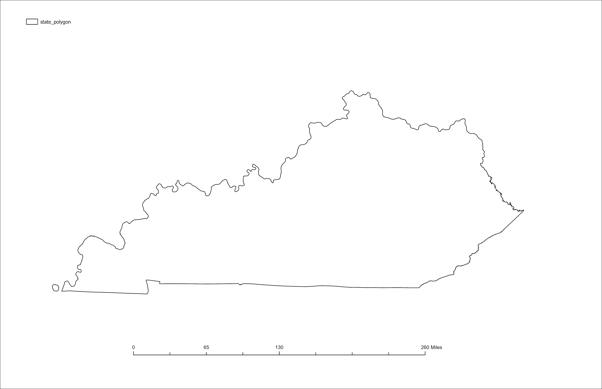

# Hello-Trees

A map made from lidar derived surface elevations and made in arcgis pro, for spring 2025

* Data from kyraster.ky.gov
* NDVI greater 0.1 vlaues used to find vegetated areas 
* Heights greater 5 

[Visit my webpage](https://web.archive.org/web/20090403025358/http://www.outragegis.com/)

# My Map Image 

# Kentucky outline

*Download [GeoPDF](Layoutkylandcover.pdf)*